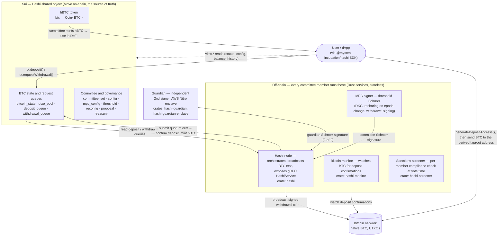

# Hashi Deep Dive

### Bitcoin as productive collateral on Sui

**Sui DeFi Specialization — internal enablement (SOLENG-641)**

Part 1: how Hashi works · Part 2: integrating the TypeScript SDK

<!-- Speaker notes: This is an internal enablement talk for the DeFi Specialization team — the people who will explain Hashi to partners. It is structured so it can be adapted for partner/external use by trimming the more candid trust-model and uncertainty slides. Goal by the end: every attendee can (1) draw the architecture, (2) state the trust assumptions honestly, and (3) integrate the SDK and run the ref-app demo. Two parts: conceptual first, SDK second. Flag up front that the protocol is pre-1.0 and currently devnet-only (BTC signet) — testnet/mainnet are not yet deployed. -->

---

## Agenda

**Part 1 — What Hashi is and how it works**

- The problem & design goals · hBTC · architecture
- Committee · MPC · reconfiguration · address scheme
- Guardian & compliance · deposit/withdraw flows
- Governance, trust model, limiter & fees · competitive landscape

**Part 2 — Integrating the SDK**

- Design philosophy & surface map · setup
- The 5 read categories · actions · integration patterns
- Live demo of the ref-app

<!-- Speaker notes: Set expectations on time. Part 1 is roughly half the deck and is concept-heavy; Part 2 is hands-on SDK plus a live demo. Encourage questions throughout but say the trust-model and competitive slides usually generate the most discussion, so we'll have time there. The demo at the end is the payoff — it ties every Part-1 concept back to a single SDK call. -->

---

# Part 1 — What Hashi is and how it works

<!-- Speaker notes: Transition slide. Part 1 grounds everyone in the protocol so the SDK in Part 2 makes sense. Everything in Part 1 is sourced from the Hashi design docs and Move/Rust source; where a claim is an interpretation rather than a documented guarantee, I'll call it out. -->

---

## The problem & design goals

- BTC is the largest crypto asset but mostly sits idle — not composable in DeFi.
- **Hashi** is the _Sui-native Bitcoin orchestrator_: a protocol for securing and managing BTC for use on Sui via **threshold cryptography** (README.mdx).
- Native on **both** sides: real on-chain P2TR deposits, real Bitcoin withdrawal txs — and the signing committee is a subset of the Sui validator set.
- **Design goals (original brief, not protocol guarantees):** the team's earlier internal brief framed the happy path as having _no change of title / no taxable event_. Treat these as design intentions to confirm, **not** documented properties.

<!-- Speaker notes: Open with the pitch: BTC is huge but idle, and Hashi makes it productive on Sui. The first sentence is verbatim from README.mdx ("Sui native Bitcoin orchestrator… secures and manages BTC… using threshold cryptography"). The fourth bullet is the most important accuracy guardrail in the whole deck: the phrases "no taxable event in the happy path" and "no change of title/ownership" appear ONLY in an older internal design brief, NOT in the design docs. Present them as original design goals/aspirations, never as protocol guarantees, and never make a legal/tax claim to a partner. -->

---

## What Hashi is: hBTC

- First feature: deposit & withdraw BTC to a managed pool; ownership on Sui is a fungible **`Coin<BTC>`** (README.mdx).
- The human-facing name for that coin is **hBTC** (user-flows.mdx); on-chain it is an ordinary Sui `Coin`.
- Because it's a standard `Coin`, it composes with any Sui DeFi protocol with no wrapper logic.
- Canonical example from the docs: deposit BTC → get hBTC → use as collateral for a **USDC loan** → repay → withdraw BTC back to Bitcoin (user-flows.mdx).

<!-- Speaker notes: The key takeaway is composability. README.mdx says ownership is represented as a fungible Coin<BTC>; user-flows.mdx uses the name hBTC and gives the USDC-loan example. Be precise: the docs say Coin<BTC>; "hBTC" is the friendly name. We have not independently confirmed the fully-qualified on-chain coin type string here, so don't quote a package::module::BTC type from memory. The point partners care about: hBTC is not a special bridge token with custom logic — it's a normal Coin. -->

---

## Architecture overview (the mental model)



**Taproot deposit address:** `tr(NUMS, { multi_a(2, guardian, child), and_v(v:older(delay), pk(child)) })` — normal spends need the guardian **and** the MPC-child (2-of-2); a timelocked recovery leaf lets the MPC-child spend alone if the guardian is unavailable.

<!-- Speaker notes: This is the diagram to leave partners with. Users straddle Bitcoin (broadcast deposit / receive withdrawal) and Sui (notify, withdraw, use hBTC). The Rust committee + guardian services sit in the middle and are deliberately STATELESS — the canonical state lives on Sui in the Hashi shared object (committee set, config, treasury, proposals, the BitcoinState UTXO pool, and the deposit/withdrawal queues). Note: the design docs describe certificates submitted by "one validator/member" and batched txs built by a "leader"; there is no separate standalone relayer role in the docs I read. -->

---

## Deposit & withdraw, at a glance

**Deposit flow** (user-flows.mdx)

```text
User    ->  Bitcoin:  Deposit native BTC
User    ->  Hashi:    Notify Hashi of deposit
Hashi   ->  Bitcoin:  Query for deposit
Hashi   ->  Hashi:    Quorum agreement on deposit
Hashi   ->  User:     hBTC sent to User
```

**Withdraw flow** (user-flows.mdx)

```text
User    ->  Hashi:    Request withdrawal
Hashi   ->  Hashi:    Craft & sign Bitcoin tx using MPC
Hashi   ->  Bitcoin:  Broadcast transaction
```

<!-- Speaker notes: These are the two canonical sequence diagrams from user-flows.mdx, rendered as text (the source is mermaid sequenceDiagram). Deposit: user sends BTC, notifies Sui with the txid, Hashi nodes watch Bitcoin and reach quorum, then hBTC is minted to the user. Withdraw: user requests on Sui, Hashi crafts and MPC-signs a Bitcoin tx sending BTC minus fees, then broadcasts. We'll unpack each into its full on-chain phase machine in the dedicated flow slides — deposit is really 4 phases, withdraw is 5. -->

---

## The committee

- Membership is **restricted to Sui validators** but **opt-in** — needs separate on-chain registration and running extra node services (committee.mdx).
- Design expects **>90% of Sui validators** to join (an expectation, not enforced).
- Not strictly identical to the validator set: Hashi keeps its own system state; coupling Sui's epoch change to MPC reconfig was rejected by the core team.
- Voting weight is **mirrored from `SuiSystemState`** (`active_validator_voting_powers`) — signing power tracks Sui stake.
- `new_member` asserts the registrant is in `sui_system.active_validator_addresses_ref()`.

<!-- Speaker notes: Anchor the mental model: the Hashi committee IS Sui validators, but a self-selected subset, not enforced by Sui reconfiguration. Why a subset and not the whole set? Hashi keeps separate system state, and forcing them to match would make Sui's epoch change block on the slow MPC hand-off — which the core team opposes. The >90% figure is a design expectation in committee.mdx, not a guaranteed property; say "expected" not "is". The crucial trust point: stake weight is copied from SuiSystemState, so you inherit Sui's economic security rather than a new operator set. -->

---

## The MPC protocol

- Validators run three MPC protocols to implement a **threshold Schnorr** signer:
  **DKG** (generate the key), **key rotation/resharing** (on committee change), **distributed signing** (sign BTC withdrawal txns).
- Two independent failure budgets (mpc-protocol.mdx):
  - **Secure** while `< t` of staking power colludes.
  - **Live** while `< f` of staking power is unresponsive.
- **v1 targets: `t ≈ 33–50%`, `f ≈ 20–33%`** (ranges, may increase — not final on-chain values).
- On-chain tuning defaults (`mpc_config.move`): threshold `3334` bps, max-faulty `3333` bps.

```move
// mpc_config.move defaults (governance-configurable)
const DEFAULT_THRESHOLD_IN_BASIS_POINTS: u64 = 3334;   // ~33.34%
const DEFAULT_MAX_FAULTY_IN_BASIS_POINTS: u64 = 3333;  // ~33.33%
```

<!-- Speaker notes: This is the cryptographic heart. Emphasize threshold SCHNORR (not ECDSA) — simpler MPC and a clean taproot output. The f/t framing from mpc-protocol.mdx is the precise way to talk about security: two budgets, liveness vs security, with concrete v1 RANGES. Show the on-chain basis-point defaults so people see it's governance state, not hardcoded. Caveat: the exact deployed t and f are not fixed — the doc gives only expected v1 ranges and notes they may increase. Don't present them as final. Also: don't conflate this Schnorr BTC-signing with the on-chain BLS12-381 certificate path used for governance/admin messages (different mechanism). -->

---

## Reconfiguration & key rotation

- Each epoch, a member calls `start_reconfig` once the Hashi epoch lags Sui's; it sets `pending_epoch_change` and **pauses deposits/withdrawals** while reconfiguring.
- **Safety gate:** new committee must cover **≥95% of total stake** (`weight_threshold(sui_system_weight, 9500)`) before it can form.
- **Genesis epoch:** full **DKG** mints a fresh master key. **Later epochs:** **resharing** — old members deal shares to new members; **the public key is unchanged**.
- On-chain invariant in `end_reconfig`: if no key yet, commit DKG output; otherwise **assert the key stays constant**, then advance the epoch.

```move
// end_reconfig (committee_set.move)
if (self.mpc_public_key.is_empty()) { self.mpc_public_key = mpc_public_key; } // genesis DKG
assert!(self.mpc_public_key == mpc_public_key); // rotation: key constant
self.epoch = next_epoch;
```

<!-- Speaker notes: Reconfiguration is the security heartbeat — MPC key shares move from the old validator committee to the new one as Sui's validator set turns over. start_reconfig freezes user-facing ops so nothing spans a half-rotated key, and has a hard 95%-of-stake registration gate. The security crux for partners: the threshold PUBLIC key is generated exactly once by DKG and then preserved across every future committee via resharing — enforced by the on-chain assert. That's why every user's derived taproot deposit address stays valid forever even as the signing validators refresh each epoch — and a dissolved past committee no longer holds usable shares. Abort path (AbortReconfig governance proposal) rolls back the pending committee, leaving epoch and key untouched. -->

---

## Deposit address scheme (timelock taproot tree)

- Every Sui address maps to **one unique P2TR** (BIP-341) deposit address — the address itself is the routing key.
- Descriptor: **`tr(NUMS, { multi_a(2, guardian, child), and_v(v:older(delay), pk(child)) })`** — `NUMS` internal key (no key-path spend) over **two** script leaves:
  - **Immediate leaf** `multi_a(2, guardian, child)` — normal spend: guardian **and** MPC-child both Schnorr-sign.
  - **Recovery leaf** `and_v(v:older(delay), pk(child))` — after a BIP-68 relative timelock, the MPC-child can spend **alone** (guardian-outage recovery).
- **Child derivation** (replicates `fastcrypto_tbls … derive_verifying_key`):
  `tweak = HKDF-SHA3-256(parent_x ‖ sui_address, len=64) mod n`; `child = parent + tweak·G`.
- `merkle_root = TapBranch(min(leaf1, leaf2), max(leaf1, leaf2))`; bech32m `bc1p…` / `tb1p…` / `bcrt1p…`.

```text
# immediate 2-of-2 leaf (70 bytes)
0x20 ‖ guardian (32)  0xAC   // <pk1> OP_CHECKSIG
0x20 ‖ child    (32)  0xBA   // <pk2> OP_CHECKSIGADD
0x52                         // OP_2
0x9C                         // OP_NUMEQUAL

# delayed MPC-only recovery leaf
<bip68_seq>  0xB2  0x69      // <delay> OP_CHECKSEQUENCEVERIFY OP_VERIFY
0x20 ‖ child    (32)  0xAC   // <pk2> OP_CHECKSIG
```

<!-- Speaker notes: Connect the single MPC master key to what users actually see — their deposit address. No per-user DKG: each address is a deterministic HKDF tweak of the master key bound to the Sui address. The taproot output now has TWO leaves (SDK PR #34): the immediate 2-of-2 (guardian + MPC-child, both must Schnorr-sign — why a committee compromise alone can't move funds) and a delayed MPC-only recovery leaf, so the MPC committee can still recover funds if the guardian goes dark, but only after a BIP-68 relative timelock. Implementation gotchas for tooling builders: operand order (guardian first) is load-bearing; OP_2 is the 0x52 small-num opcode (rust-miniscript style); and the two leaf hashes are sorted (min‖max) into the TapBranch — any deviation changes the address. ACCURACY CAVEAT: the public address-scheme.mdx page may still describe an older/single-leaf variant; the SDK (bitcoin.ts, #34) is authoritative for what generateDepositAddress actually produces — verify against the live deployment. -->

---

## Guardian & sanctions / compliance

- The **guardian** is the **second signatory** on the immediate spend path: normal moves are 2-of-2 (guardian + MPC committee) — defense in depth against a compromised _or malicious past_ committee. A timelocked recovery leaf lets the MPC committee recover funds **alone** if the guardian is unavailable (guardian.mdx).
- Runs inside an **AWS Nitro Enclave** (TEE): ephemeral keys per session, NSM attestation over its signing key, signed immutable S3 audit logs; enforces a withdrawal **rate limiter** and verifies the committee cert before co-signing.
- **Sanctions screening is per-validator, best-effort** (sanctions.mdx): each member calls a configurable gRPC `ScreenerService.Approve` at vote time (OFAC list, TRM, Chainalysis; ref impl uses MerkleScience).
- Limits to be honest about: a quorum can accept what one validator rejected; once a UTXO is in the pool it's treated as the protocol's own.

<!-- Speaker notes: Two distinct mechanisms — don't blur them. (1) The guardian is a second 2-of-2 signer for defense-in-depth, running in a hardened Nitro enclave with attestation, audit logs, and a withdrawal rate limiter. guardian.mdx is brief and says "additional details added before Testnet," so its public design is explicitly incomplete. (2) Sanctions screening is SEPARATE: it's per-validator, runs in the committee/node voting path, and is best-effort. IMPORTANT accuracy note: in the source I reviewed the guardian enclave does NOT itself call the screener — it co-signs after verifying the committee cert and rate limits; screening lives in the committee node software. So frame the guardian as compliance-adjacent defense-in-depth, not as the sanctions enforcer. -->

---

## Deposit flow (4 phases)

`Request → Approve → Confirm → Mint`

- **Request:** user broadcasts BTC to their unique P2TR address, then records it on Sui (`deposit()` → `DepositRequestedEvent`).
- **Approve:** committee waits for `bitcoin_confirmation_threshold` blocks + per-node screening → quorum cert + `approval_timestamp_ms`.
- **Time-delay:** `confirm_deposit` must wait `bitcoin_deposit_time_delay_ms` after approval — a window for operators to detect a bad approval and pause.
- **Confirm/Mint:** cert re-verified against the **current** committee (a rotated-out approval is invalid), then hBTC minted and the UTXO joins the active pool.

```move
// deposit.move — confirm time-delay assert
assert!(approval_timestamp_ms + config.deposit_time_delay_ms()
        <= clock.timestamp_ms(), EDepositTimeDelayNotPassed);
```

<!-- Speaker notes: The user only does two active steps — send BTC and call deposit() — the rest is the committee. The Approve/Confirm split (with the configurable time-delay) is the security heart: approval records a cert + timestamp but no hBTC exists yet; the delay gives operators a pause window. confirm re-verifies against the CURRENT committee, so an epoch rotation during the delay invalidates the old approval (a deliberate safety property). The exact numeric values of the confirmation threshold, time-delay, and deposit minimum are governance config read on-chain — say "governance-configured", don't invent numbers. The SDK floor for amounts is DUST_RELAY_MIN_VALUE = 546 sats; the deployed minimum may be higher (default seen in code ~30,000 sats). -->

---

## Withdrawal flow (5 phases)

`Requested → Approved → Processing → Signed → Confirmed`

- **Request:** `request_withdrawal(hashi, clock, btc: Balance<BTC>, bitcoin_address, ctx)` — full hBTC escrowed; miner fee deducted later at commit.
- **Approve:** quorum cert + guardian rate-limiter + per-member destination screening.
- **Build TX:** a leader batches approved requests into one Bitcoin tx (coin selection + one change output back to the pool); `commit_withdrawal_tx` **burns the hBTC** (point of no return).
- **Sign (2-of-2):** guardian Schnorr sig per input + MPC threshold-Schnorr sig per input, bound by one cert.
- **Broadcast → Confirm:** after `bitcoin_confirmation_threshold` blocks, inputs marked spent, change promoted.

<!-- Speaker notes: The user submits hBTC (as a Balance<BTC>) plus a destination; the full amount is escrowed and the miner fee is taken later when the committee builds the actual tx. commit_withdrawal_tx is the point of no return — hBTC is burned, so the BTC must now be delivered. Sign mirrors the 2-of-2 deposit address: guardian per input + MPC per input, both arrays committed under one cert so a malicious leader can't pair valid MPC sigs with garbage guardian sigs. CANCEL nuance worth flagging: withdraw.mdx prose says cancel is allowed "before approved," but the Move code (authoritative) allows cancel through Requested OR Approved, blocked only once Processing — the .mdx wording is stale. On devnet, no guardian may be configured, so only the MPC signature is used. -->

---

## Governance & security / trust model

- All governance is one generic **`Proposal<T>`**: a committee member proposes, members vote (stake-weighted), quorum executes; 7-day expiry, single-shot, version-gated.
- Quorum/certificate threshold = **`6667` bps (>2/3, `2f+1` of `3f`)** — matches Sui's own quorum (`threshold.move`).
- **Asymmetric thresholds:** Upgrade / Enable / Disable version = **100%**; Update Config / Update Guardian / Abort Reconfig = **6667 bps**; **Emergency Pause = 500 bps (5%, fast)**, **Unpause = 6667 bps**.
- **Trust reduces to:** an honest **>2/3 Sui validator stake** majority **+** an independent **guardian** — no new custodian.
  - `>1/3` malicious → can stall/censor; `>2/3` malicious → could act maliciously.
  - Guardian adds defense-in-depth, **not custody**; its BTC key is immutable once set.

<!-- Speaker notes: This is the slide partners care about most. Two independent layers. Layer 1: the committee is drawn from Sui validators and weighted by Sui stake, so trusting Hashi ≈ trusting Sui's >2/3 honest-stake assumption. The asymmetric thresholds are a strong story: the most dangerous actions need 100%; routine changes need >2/3; emergency pause is cheap (5% default) so a small honest minority can halt fast, but un-pausing needs a real supermajority; and you cannot disable the active version (no accidental brick). Layer 2: the guardian co-signs the immediate 2-of-2 spend path (a timelocked leaf allows MPC-only recovery after a delay) — it never holds keys alone, is not a custodian, and its BTC key is pinned forever (rotating it would invalidate every derived address). Caveats: the 500/6667 pause values are in-code DEFAULTS, governance-tunable; the BFT attack taxonomy is the standard interpretation, not spelled out verbatim in docs. -->

---

## Limiter & fees

- **Rate limiter** (guardian): token-bucket cap on **withdrawal outflows only** — BTC-denominated capacity refilling over a fixed window. Deposits are _not_ rate-limited. (Cap & window are configurable; defaults not in the docs.)
- **Deposits:** no protocol fee — user pays only Sui gas; must meet `bitcoin_deposit_minimum`.
- **Withdrawals:** no protocol fee — only the **Bitcoin miner fee**, deducted from the user's output (pool stays whole).
- `withdrawal_minimum = worst_case_network_fee + DUST_RELAY_MIN_VALUE` (defaults: `29,454 + 546 = 30,000` sats).
- Fee rate from Bitcoin Core `estimatesmartfee` (economical), capped (≈30 sat/vB); no RBF — stuck txs use **CPFP**.

<!-- Speaker notes: The limiter is a safety valve, not a fee — it throttles only the BTC leaving custody, where a bug or exploit would drain value. Deposits are free (Sui gas only); withdrawals carry no protocol fee, just the real miner fee subtracted from the payout so the UTXO pool never shrinks below withdrawn + change. The withdrawal minimum is engineered as worst-case-fee + 546-sat dust floor, so even at max fee a minimum withdrawal still yields a valid non-dust output. In practice fees are far lower and the user keeps the surplus. CAVEATS: the limiter cap/window defaults aren't in the docs (configurable); fees.mdx has an intro line mentioning "a flat deposit fee in SUI" and "a withdrawal fee in BTC" that the body and btc_config.move do NOT reflect — treat the no-protocol-fee model as current and flag the doc inconsistency. Also a code/comment mismatch: deposit time-delay default is 10 min in code, comment says 15. -->

---

## Competitive landscape

| Approach                   | Crypto                    | Committee                                       | Trust                            |
| -------------------------- | ------------------------- | ----------------------------------------------- | -------------------------------- |
| **Hashi**                  | threshold **Schnorr**     | **subset of Sui validator set** (>90% expected) | honest >2/3 Sui stake + guardian |
| ICP Chain Fusion           | threshold ECDSA & Schnorr | small subnet (~13 nodes)                        | subnet replicas                  |
| NEAR Chain Abstraction     | threshold ECDSA & Schnorr | static (~8 nodes), TEE migration                | MPC node set                     |
| IKA                        | threshold ECDSA & Schnorr | dynamic, 2pc-mpc (½ key network / ½ user)       | novel primitives                 |
| Custodial / wrapped (wBTC) | none                      | single custodian                                | one centralized entity           |

**Hashi's documented edge:** standard threshold Schnorr → simpler MPC · committee = Sui validators → **no new trusted entity** · independent 2-of-2 guardian.

<!-- Speaker notes: Frame as a fair map, not a hit piece. Lead with Hashi's documented differentiators: (1) threshold Schnorr keeps the MPC math simpler and yields a clean taproot output; (2) the committee IS the Sui validator set, so consumers don't trust a new external operator — trust ≈ "trust Sui"; (3) an independent guardian gives 2-of-2 defense in depth. ICP is the closest on crypto quality but its committee is a small subnet; NEAR ships a working MPC but is mid-migration to TEE-based MPC; IKA bets on newer, less-reviewed 2pc-mpc primitives; wBTC is pure custodial trust. CRITICAL CAVEAT: every competitor fact (node counts, crypto authorship, roadmaps) comes ONLY from an internal competitive-analysis brief and is NOT verified against source — present as point-in-time internal read, recheck before external use. -->

---

# Part 2 — Integrating the SDK

`@mysten-incubation/hashi` · v0.3.0 · Apache-2.0 · pre-1.0 · devnet/signet only

<!-- Speaker notes: Transition to the hands-on half. Repeat the maturity caveat: 0.3.0, pre-1.0, currently devnet-only with BTC signet by default; testnet/mainnet not yet deployed. Everything from Part 1 now maps to a concrete SDK call, culminating in the live demo. -->

---

## SDK design philosophy + surface map

- **Strictly client-facing:** the SDK wraps only what an _end user_ does — `deposit`, `requestWithdrawal`, `cancelWithdrawal`. No operator/committee/relayer calls.
- Operator tooling imports the generated Move bindings under `src/contracts/hashi/` directly.
- **Two execution surfaces:** direct methods (pass a `Signer`, sign + execute in one call) vs `tx.*` builders (return an unsigned `Transaction` for sponsored tx / dry-run / PTB bundling).
- **Five namespaces hang off `client.hashi`:** `view.*` (reads) · direct methods + `tx.*` / `call.*` (actions) · `waitFor*` (polling) · `bitcoin.*` (optional BTC RPC) · typed errors.

<!-- Speaker notes: Lead with the single most important design choice: the SDK is deliberately scoped to the three things an end user does. Everything operator/committee needs is reachable via auto-generated bindings, so the SDK stays small and safe. Two altitudes: direct Signer methods for the happy path (server/scripts), and tx.* builders when you need a browser wallet to sign or to compose into a bigger PTB / sponsor it. Then the five namespaces — this is the map every partner question routes to. The index also exports lower-level bitcoin helpers (deriveChildPubkey, twoOfTwoTaprootScriptPathAddress, etc.) for advanced use. -->

---

## Setup (install + `$extend`)

```ts
// pnpm add @mysten-incubation/hashi @mysten/sui   (@mysten/sui is a peer dep)
import { SuiGrpcClient } from "@mysten/sui/grpc";
import { Ed25519Keypair } from "@mysten/sui/keypairs/ed25519";
import { hashi } from "@mysten-incubation/hashi";

const client = new SuiGrpcClient({
  network: "devnet",
  baseUrl: "https://fullnode.devnet.sui.io:443",
}).$extend(hashi({ network: "devnet" }));

const signer = Ed25519Keypair.fromSecretKey(/* … */);
const btc = await client.hashi.generateDepositAddress({
  suiAddress: signer.toSuiAddress(),
});
```

<!-- Speaker notes: One factory call, one $extend, and the entire SDK hangs off client.hashi. @mysten/sui is a peer dependency — install both. The SDK accepts any ClientWithCoreApi, so transports other than gRPC should work, though gRPC is the example. This snippet is the canonical setup partners copy. The generateDepositAddress call at the end is the natural first thing to try — and the first read we'll dig into. -->

---

## The 5 read categories (1/3) — one snapshot

- All governance reads flow through **`view.all()`** → a frozen `GovernanceConfig` (one `Hashi.get` round-trip).
- Per-field getters (`view.paused()`, `view.bitcoinDepositMinimum()`, …) just await `view.all()` and pick a field — prefer `view.all()` when you need 2+ values.
- Two reads bypass the config VecMap: **`view.mpcPublicKey()`** and **`generateDepositAddress()`** (fetches committee + guardian keys directly).
- The same `view.all()` snapshot powers both reads _and_ write preflight (pause + minimum checks).

```ts
const snap = await client.hashi.view.all(); // GovernanceConfig (readonly)
const paused = await client.hashi.view.paused(); // thin awaiter
const depMin = await client.hashi.view.bitcoinDepositMinimum();
```

<!-- Speaker notes: Frame the whole topic: there is essentially one canonical read, view.all(), returning a typed GovernanceConfig snapshot from a single fetch. Every scalar getter is a thin awaiter over view.all(), so for two or more values, call view.all() once. The two reads that don't go through the config VecMap are view.mpcPublicKey() and generateDepositAddress(). And the same snapshot is reused inside deposit()/requestWithdrawal() preflight, so reads and write validation share one fetch. The five categories map directly onto ref-app sections 1–3, which we'll see in the demo. -->

---

## The 5 read categories (2/3) — Status, Config, Committee

**1 Protocol Status** · **2 Config**

```ts
const snap = await client.hashi.view.all();
if (snap.paused) throw new Error("bridge paused");
snap.bitcoinDepositMinimum; // bigint sats (floored to >= 546)
snap.bitcoinConfirmationThreshold; // bigint, BTC blocks
snap.bitcoinDepositTimeDelayMs; // bigint ms
snap.worstCaseNetworkFee; // sats deducted on withdraw
```

**3 Committee Info**

```ts
const mpcKey = await client.hashi.view.mpcPublicKey(); // 33-byte compressed secp256k1
const cfg = await client.hashi.view.all();
const provisioned = cfg.guardianBtcPublicKey != null; // null until set on-chain
```

<!-- Speaker notes: Protocol Status is one boolean — view.paused() — mirrored on-chain by assert_unpaused. Note cancelWithdrawal deliberately has NO pause check so users can always recover funds. Config: every governance-tunable param is a readonly bigint on the snapshot, floored client-side to DUST_RELAY_MIN_VALUE (546) to match Move. Committee Info has two sources: view.mpcPublicKey() returns the 33-byte compressed secp256k1 threshold key (set after DKG; THROWS HashiConfigError if DKG hasn't run — the on-chain key is arkworks-compressed and the SDK converts to SEC1 transparently), and the guardian's three fields (URL, Ed25519 attestation key, BIP-340 x-only BTC key) live on the same view.all() snapshot, all null until provisioned. -->

---

## The 5 read categories (3/3) — Address & Observability

**4 Deposit Address Derivation** — the marquee read

```ts
try {
  const btcAddr = await client.hashi.generateDepositAddress({
    suiAddress: account.address,
  }); // -> tb1p… (bech32m P2TR; timelock taproot tree)
} catch (e) {
  if (e instanceof HashiConfigError) {
    /* guardian_btc_public_key not yet set */
  }
}
```

**5 Governance Observability** — `view.all()` exposes every governance param + guardian provisioning state (`guardian*` null until set), so a dApp renders live status with **no operator access**.

<!-- Speaker notes: generateDepositAddress fetches both keys in one round-trip, derives the per-Sui-address MPC child via HKDF-SHA3-256 (byte-for-byte matching the Rust fastcrypto derivation), and assembles the two-leaf taproot tree (immediate 2-of-2 + delayed recovery; guardian first — ordering load-bearing). It HARD-FAILS with HashiConfigError until the deployment publishes guardian_btc_public_key; the SDK refuses a single-key fallback because the bridge validator would reject it. Governance Observability is the umbrella: view.all() plus the null-or-set guardian fields let a partner dApp show live protocol status and a provisioning badge entirely from public reads. -->

---

## Actions — `tx.*` builders vs direct `Signer`

```ts
// Direct (server / scripts): SDK signs + executes
const res = await client.hashi.deposit({
  signer,
  txid: `0x${btcTxid}`, // DISPLAY byte order — SDK reverses internally
  utxos: [{ vout: 0, amountSats: 100_000n }],
  recipient: signer.toSuiAddress(),
});

// dapp-kit (browser): build unsigned, connected wallet signs
const transaction = client.hashi.tx.deposit({ txid, utxos, recipient });
const res2 = await dAppKit.signAndExecuteTransaction({ transaction });
```

- Direct `deposit` / `requestWithdrawal` / `cancelWithdrawal` call `signAndExecuteTransaction` with `{ effects, events }`.
- `tx.*` returns an unsigned `Transaction`; `call.*` is even lower (auto-injects shared object + package id).
- `cancelWithdrawal` does **no pause check** — users can always unwind.

<!-- Speaker notes: The core mental model again, now concrete. Direct methods take a Signer and do sign+execute in one call, returning effects and events so you read the emitted event without a second round-trip — great for backends/scripts. tx.* returns an unsigned Transaction so a browser wallet can sign (the realistic dApp pattern, exactly how the ref-app works via dAppKit.signAndExecuteTransaction). Below sits call.* which auto-injects the Hashi shared object and package id. Note the result is a discriminated union on $kind ('Transaction' | 'FailedTransaction') so consumers must handle failure. The direct requestWithdrawal accepts a bech32(m) address STRING (decoded for you); the tx builder takes raw witness-program bytes — see the next slide. -->

---

## Integration patterns — polling, reads, fees, dedup

```ts
// Status polling — imperative (Node) and declarative (React)
const info = await client.hashi.waitForDeposit(digest, { intervalMs: 10_000, signal });
// confirmableAtMs = approvalTimestampMs + bitcoinDepositTimeDelayMs (countdown UX)

const bal = await client.hashi.view.balance(owner); // { totalBalance, coinObjectCount }
const hist = await client.hashi.view.transactionHistory(address); // deposits + withdrawals
const fees = await client.hashi.view.withdrawalFees(sender); // worstCase, minimum, gas
const used = await client.hashi.view.findUsedUtxos(utxos); // dedupe before re-submit
```

- `bitcoin.*` (`lookupVout`, `confirmations`) — **optional**, requires `btcRpcUrl` or throws.
- `view.depositStatus` / `view.withdrawalStatus` → status enums; `waitFor*` poll to terminal (default `intervalMs 15_000`, `AbortSignal`).
- `findUsedUtxos` re-throws non-"object-not-found" errors so a transient blip is never silently `isUsed:false`.

<!-- Speaker notes: Round out the read/utility surface. Status tracking has two flavors: point-in-time view.depositStatus/withdrawalStatus, and imperative waitForDeposit/waitForWithdrawal that loop to terminal (default 15s, AbortSignal). The killer UX field is confirmableAtMs (approval + on-chain time-delay) for a countdown. balance reports total sats + coin-object count; transactionHistory unifies on-chain requests with in-flight deposits via GraphQL and degrades gracefully. Fee helpers dry-run with a 20% buffer (gas only if you pass sender; returns 0n on simulation failure). findUsedUtxos is the pre-flight before re-submitting a deposit and is careful never to downgrade a transport error to "unused". bitcoin.* is gated on btcRpcUrl. -->

---

## Integration patterns — typed errors & the txid gotcha

```ts
try {
  await client.hashi.requestWithdrawal({ signer, amountSats: 1000n, bitcoinAddress: "tb1p…" });
} catch (e) {
  if (e instanceof AmountBelowMinimumError) console.error(e.violations);
  else if (e instanceof InvalidBitcoinAddressError && e.code === "wrong-network") {
    /* prompt */
  } else if (e instanceof HashiPausedError) {
    /* protocol paused */
  }
}
```

- Typed, `instanceof`-checkable: `InvalidParamsError`, `HashiPausedError`, `AmountBelowMinimumError` (`.violations`), `InvalidBitcoinAddressError` (`.code`), `HashiConfigError`, `HashiFetchError`.
- **⚠ Byte-order gotcha (SEDEFI-190):** txids passed to `deposit` / `findUsedUtxos` are **DISPLAY order** (mempool.space / `bitcoin-cli`). The SDK reverses to internal little-endian via `reverseTxidBytes`. **Do not pre-reverse** — internal-order bytes make the deposit silently never confirm.

<!-- Speaker notes: All preflight failures are typed and instanceof-checkable with structured fields (AmountBelowMinimumError.violations is one per UTXO; InvalidBitcoinAddressError.code is wrong-network/bad-checksum/etc.) for targeted UX. End on the number-one footgun: txids are DISPLAY order on the way in — the form a block explorer shows — and the SDK reverses them for you internally, because the committee verifier reads Utxo.txid as a bitcoin::Txid (internal/little-endian). If a partner pre-reverses, the committee hunts a phantom byte-reversed tx and the deposit silently never confirms. This is the single most common integration bug; hammer it. -->

---

## Live demo — setup + §1–§3 (read & derive)

```bash
pnpm install && pnpm --filter ref-app dev   # http://localhost:5173 (devnet / signet)
```

- Connect the **dev-wallet** (a dapp-kit `walletInitializer`) — fresh in-browser key via WebCrypto/IndexedDB, no extension.
- **§1 Protocol status & config** — `view.all()`: live/paused badge + minimums, confirmation threshold, time-delay, cooldown, worst-case fee.
- **§2 Committee & guardian** — `view.mpcPublicKey()` + guardian fields from `view.all()`; badge "provisioned" vs "not provisioned".
- **§3 Deposit address** — `generateDepositAddress({ suiAddress })` → `tb1p…`; fund via a signet faucet.
- **Fallbacks:** pre-DKG → §2 catches the `mpcPublicKey()` throw; guardian unset → §3 catches `HashiConfigError` ("guardian not provisioned").

<!-- Speaker notes: Launch the app and connect dev-wallet first — no extension, key generated in-browser, which is what makes this reproducible on any laptop. §1 proves the SDK reads live governance config in one view.all(). §2 shows both halves of the security model — MPC key + guardian. §3 is the payoff: one generateDepositAddress call reproduces the entire taproot-tree derivation. CRITICAL: devnet may be pre-DKG and/or have no guardian provisioned — the app is built with graceful callouts for exactly this, so you never show a raw stack trace. Verify the devnet state BEFORE presenting so you know which path you're on. -->

---

## Live demo — §4–§6 (deposit, mint, fees)

```ts
// §4 — compose unsigned, sign via wallet (dapp pattern), then poll
const transaction = client.hashi.tx.deposit({ txid, utxos, recipient });
await dAppKit.signAndExecuteTransaction({ transaction });
// poll view.depositStatus(digest) until 'confirmed' | 'expired'
```

- **§4 Record deposit** — paste funding txid (display order, `0x`-prefixed) + vout/amount rows; pre-check `view.findUsedUtxos`; live `confirmableAtMs` countdown.
- **§5 hBTC balance** — `view.balance(owner)` → `totalBalance` + `coinObjectCount`; refresh to watch hBTC appear once minted.
- **§6 Fees & gas** — `view.depositGasEstimate(sender)` + `view.withdrawalFees(sender)`.
- **Fallback:** confirmation needs committee approval + time-delay → may stay "pending" on devnet; show the status panel + fee reads instead of waiting.

<!-- Speaker notes: §4 is the heart of the deposit lifecycle — point out the txid is display order and that findUsedUtxos pre-flights a deposit before spending gas. The app composes an unsigned Transaction and signs via dapp-kit, mirroring a real partner integration. The status tracker proves the SDK follows a deposit to confirmation with a live confirmableAtMs countdown driven by the on-chain time-delay. §5 proves hBTC is just a Sui Coin you read with balance(). §6 shows fee/gas transparency before committing. REALITY CHECK: on devnet the committee may not actually mint, so the deposit can stay pending — lean on the status panel, the countdown, and §6 reads to keep the demo moving; don't promise a live mint. -->

---

## Live demo — §7–§10 (withdraw, cancel, history)

```ts
// §7 — decode BTC address to witness program, then request
const { program } = bitcoinAddressToWitnessProgram(bitcoinAddress, "signet");
await dAppKit.signAndExecuteTransaction({
  transaction: client.hashi.tx.requestWithdrawal({ amount, bitcoinAddress: program }),
});
// §8 cancel uses the requestId auto-pasted from §7
```

- **§7 Request withdrawal** — destination `tb1q…`/`tb1p…` + amount; tracker polls `view.withdrawalStatus` through `Requested → … → Confirmed`.
- **§8 Cancel** — `tx.cancelWithdrawal({ requestId, recipient })`; Move enforces requester-only, Requested/Approved-only, post-cooldown.
- **§9 History** — `view.transactionHistory(address)` (unified deposits + withdrawals). **§10** in-memory activity log = session recap.
- **Fallback:** no hBTC to withdraw on devnet → still demo the §7 builder/validation and the §9 history read.

<!-- Speaker notes: §7 closes the loop — the SDK decodes a normal signet address into a witness program and submits a withdrawal, tracking the full five-state lifecycle. Nice UX touch: the requestId from §7 flows automatically into §8 via shared App state. For §8, emphasize the SDK exposes only user-facing actions — cancel's three constraints are enforced on-chain in Move, not faked in the client. Finish on §9 (unified history) and §10 (activity log) as a recap of every digest from the session. If devnet hasn't minted hBTC you may have nothing to withdraw — fall back to the §7 builder/validation and the history/log reads so the narrative still lands. -->

---

## Recap & resources

**You can now:** draw the architecture · state the trust model honestly · integrate the SDK · run the demo.

- **Threshold Schnorr** MPC signer, committee = **subset of Sui validators** (no new trusted entity).
- **Timelock taproot** address — immediate 2-of-2 (guardian + MPC-child) + delayed MPC-only recovery; hBTC is an ordinary `Coin<BTC>`.
- SDK is **strictly client-facing**: 5 read categories + 3 actions + polling + typed errors.

**Resources**

- Design docs: https://mystenlabs.github.io/hashi
- npm: `@mysten-incubation/hashi`
- Reference app (live demo): `ref-app/` in this repo

**Q & A**

<!-- Speaker notes: Recap the three competencies. Reinforce the differentiators one last time: threshold Schnorr → simpler MPC, committee = Sui validator set → no new trusted entity, 2-of-2 guardian → defense in depth, hBTC = ordinary Coin. Point to resources: the public docs site, the npm package, and the ref-app as the runnable reference. For Q&A, the predictable hard questions are: tax/title (answer: original design goals only, NOT a protocol or legal guarantee), exact thresholds (answer: governance-configured; v1 t/f are ranges), and devnet vs production address scheme (answer: the production form is a two-leaf timelock taproot (immediate 2-of-2 + delayed MPC-only recovery); the public address-scheme doc may lag the SDK). -->
